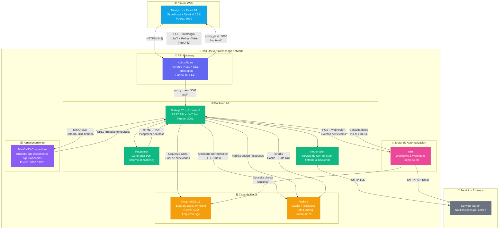

# Diagrama de Arquitectura — SGC-UNT v2.0

```mermaid
graph TD
    subgraph CLIENTE["🌐 Cliente Web"]
        CW["Next.js 14 / React 18\n(TypeScript + Tailwind CSS)\nPuerto: 3000"]
    end

    subgraph GATEWAY["🔀 API Gateway"]
        NG["Nginx Alpine\nReverse Proxy + SSL Termination\nPuerto: 80 / 443"]
    end

    subgraph BACKEND["⚙️ Backend API"]
        BE["Node.js 20 + Express 5\nREST API + JWT Auth\nPuerto: 3001"]
        PDF["Puppeteer\nGenerador PDF\n(interno al backend)"]
        MAIL["Nodemailer\nServicio de Correo SMTP\n(interno al backend)"]
        BE --> PDF
        BE --> MAIL
    end

    subgraph AUTOMATION["🤖 Motor de Automatización"]
        N8N["n8n\nWorkflows & Webhooks\nPuerto: 5678"]
    end

    subgraph DATA["🗄️ Capa de Datos"]
        PG["PostgreSQL 16\nBase de Datos Principal\nPuerto: 5432\nEsquema: sgc"]
        RD["Redis 7\nCaché + Sesiones\n+ Rate Limiting\nPuerto: 6379"]
    end

    subgraph STORAGE["📦 Almacenamiento"]
        MN["MinIO (S3-Compatible)\nBuckets: sgc-documentos\nsgc-evidencias\nPuerto: 9000 / 9001"]
    end

    subgraph EXTERNAL["📧 Servicios Externos"]
        SMTP["Servidor SMTP\nNotificaciones por correo"]
    end

    subgraph DOCKER["🐳 Red Docker Interna: sgc-network"]
        GATEWAY
        BACKEND
        AUTOMATION
        DATA
        STORAGE
    end

    %% Flujos HTTP
    CW -->|"HTTPS (443)"| NG
    NG -->|"proxy_pass :3001\n/api/*"| BE
    NG -->|"proxy_pass :3000\n/frontend/*"| CW

    %% Autenticación JWT
    CW -->|"POST /auth/login\n→ JWT + RefreshToken (httpOnly)"| NG
    BE -->|"Almacena RefreshToken\n(TTL 7 días)"| RD
    BE -->|"Verifica sesión / bloqueos"| RD

    %% Base de datos
    BE -->|"Sequelize ORM\nPool de conexiones"| PG
    BE -->|"ioredis\nCaché + Rate limit"| RD

    %% Almacenamiento archivos
    BE -->|"MinIO SDK\nUpload / URL firmada"| MN

    %% Webhooks n8n
    BE -->|"POST /webhook/*\nEventos del sistema"| N8N
    N8N -->|"Consulta datos\nvía API REST"| BE
    N8N -->|"Consulta directa\n(opcional)"| PG

    %% Generación reportes
    PDF -->|"HTML → PDF\nPuppeteer headless"| BE
    MN -->|"URLs firmadas temporales"| BE

    %% Notificaciones
    MAIL -->|"SMTP TLS"| SMTP
    N8N -->|"SMTP / API Email"| SMTP

    %% Estilos
    classDef cliente fill:#0ea5e9,stroke:#0284c7,color:#fff
    classDef gateway fill:#6366f1,stroke:#4f46e5,color:#fff
    classDef backend fill:#10b981,stroke:#059669,color:#fff
    classDef data fill:#f59e0b,stroke:#d97706,color:#fff
    classDef storage fill:#8b5cf6,stroke:#7c3aed,color:#fff
    classDef automation fill:#ec4899,stroke:#db2777,color:#fff
    classDef external fill:#6b7280,stroke:#4b5563,color:#fff

    class CW cliente
    class NG gateway
    class BE,PDF,MAIL backend
    class PG,RD data
    class MN storage
    class N8N automation
    class SMTP external
```
