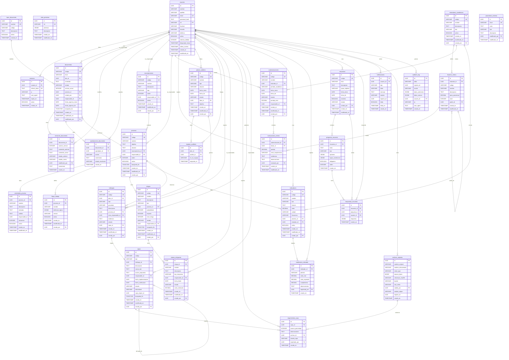

# Diagrama Entidad-Relación — SGC-UNT v2.0

```mermaid
erDiagram
    usuarios {
        UUID id PK
        VARCHAR nombre
        VARCHAR apellido
        VARCHAR email UK
        TEXT password_hash
        VARCHAR rol FK
        VARCHAR facultad
        VARCHAR escuela
        VARCHAR telefono
        BOOLEAN activo
        INTEGER intentos_fallidos
        TIMESTAMP bloqueado_hasta
        TIMESTAMP ultimo_acceso
        TIMESTAMP creado_en
        TIMESTAMP modificado_en
    }

    sesiones {
        UUID id PK
        UUID usuario_id FK
        TEXT refresh_token UK
        VARCHAR ip
        TEXT user_agent
        TIMESTAMP expira_en
        BOOLEAN activo
        TIMESTAMP creado_en
    }

    roles_permisos {
        UUID id PK
        VARCHAR rol UK
        JSONB permisos
        TEXT descripcion
        TIMESTAMP creado_en
        TIMESTAMP modificado_en
    }

    tipos_documento {
        UUID id PK
        VARCHAR nombre UK
        VARCHAR codigo
        TEXT descripcion
        BOOLEAN activo
        TIMESTAMP creado_en
    }

    documentos {
        UUID id PK
        VARCHAR codigo UK
        VARCHAR titulo
        UUID tipo_id FK
        TEXT contenido
        VARCHAR estado
        INTEGER version_actual
        UUID proceso_id FK
        UUID creado_por FK
        UUID responsable_id FK
        DATE fecha_vigencia_inicio
        DATE fecha_vigencia_fin
        TSVECTOR busqueda_fts
        TIMESTAMP creado_en
        TIMESTAMP modificado_en
        UUID modificado_por FK
    }

    versiones_documento {
        UUID id PK
        UUID documento_id FK
        INTEGER numero_version
        TEXT contenido_anterior
        TEXT contenido_nuevo
        VARCHAR estado_anterior
        VARCHAR estado_nuevo
        UUID modificado_por FK
        TEXT comentario
        TIMESTAMP creado_en
    }

    aprobaciones_documento {
        UUID id PK
        UUID documento_id FK
        UUID aprobador_id FK
        VARCHAR accion
        TEXT comentario
        VARCHAR estado_resultante
        TIMESTAMP creado_en
    }

    macroprocesos {
        UUID id PK
        VARCHAR codigo UK
        VARCHAR nombre
        TEXT descripcion
        VARCHAR tipo
        INTEGER orden
        UUID responsable_id FK
        BOOLEAN activo
        TIMESTAMP creado_en
        TIMESTAMP modificado_en
        UUID creado_por FK
    }

    procesos {
        UUID id PK
        VARCHAR codigo UK
        VARCHAR nombre
        TEXT objetivo
        TEXT alcance
        UUID macroproceso_id FK
        UUID responsable_id FK
        INTEGER orden
        BOOLEAN activo
        TSVECTOR busqueda_fts
        TIMESTAMP creado_en
        TIMESTAMP modificado_en
        UUID creado_por FK
    }

    actividades_proceso {
        UUID id PK
        UUID proceso_id FK
        VARCHAR nombre
        TEXT descripcion
        TEXT entradas
        TEXT salidas
        UUID responsable_id FK
        INTEGER secuencia
        BOOLEAN activo
        TIMESTAMP creado_en
        TIMESTAMP modificado_en
    }

    flujos_trabajo {
        UUID id PK
        UUID proceso_id FK
        VARCHAR nombre
        JSONB definicion_bpmn
        VARCHAR version
        BOOLEAN activo
        TIMESTAMP creado_en
        TIMESTAMP modificado_en
        UUID creado_por FK
    }

    estandares_acreditacion {
        UUID id PK
        VARCHAR codigo UK
        VARCHAR nombre
        TEXT descripcion
        VARCHAR tipo
        BOOLEAN activo
        TIMESTAMP creado_en
        TIMESTAMP modificado_en
        UUID creado_por FK
    }

    factores_criterio {
        UUID id PK
        UUID estandar_id FK
        VARCHAR codigo
        VARCHAR nombre
        TEXT descripcion
        DECIMAL peso_porcentual
        INTEGER nivel
        UUID padre_id FK
        TIMESTAMP creado_en
        TIMESTAMP modificado_en
    }

    autoevaluaciones {
        UUID id PK
        VARCHAR codigo UK
        VARCHAR nombre
        UUID estandar_id FK
        VARCHAR periodo_academico
        DATE fecha_inicio
        DATE fecha_fin
        VARCHAR estado
        DECIMAL puntaje_total
        UUID responsable_id FK
        TIMESTAMP creado_en
        TIMESTAMP modificado_en
        UUID creado_por FK
    }

    evaluaciones_criterio {
        UUID id PK
        UUID autoevaluacion_id FK
        UUID factor_id FK
        DECIMAL puntaje
        VARCHAR nivel_cumplimiento
        TEXT evidencias
        TEXT observaciones
        UUID evaluado_por FK
        TIMESTAMP creado_en
        TIMESTAMP modificado_en
    }

    planes_auditoria {
        UUID id PK
        VARCHAR codigo UK
        VARCHAR nombre
        VARCHAR tipo
        VARCHAR alcance
        DATE fecha_inicio
        DATE fecha_fin
        VARCHAR estado
        UUID lider_id FK
        TEXT objetivo
        TIMESTAMP creado_en
        TIMESTAMP modificado_en
        UUID creado_por FK
    }

    equipos_auditoria {
        UUID id PK
        UUID plan_id FK
        UUID auditor_id FK
        VARCHAR rol_en_equipo
        TIMESTAMP asignado_en
    }

    hallazgos {
        UUID id PK
        VARCHAR codigo UK
        UUID plan_id FK
        VARCHAR tipo
        VARCHAR gravedad
        TEXT descripcion
        UUID proceso_id FK
        UUID area_responsable_id FK
        TEXT evidencia
        VARCHAR estado
        UUID capa_id FK
        TIMESTAMP creado_en
        TIMESTAMP modificado_en
        UUID creado_por FK
    }

    capas {
        UUID id PK
        VARCHAR codigo UK
        VARCHAR tipo
        UUID hallazgo_id FK
        TEXT descripcion
        TEXT causa_raiz
        TEXT accion_propuesta
        UUID responsable_id FK
        DATE fecha_implementacion
        DATE fecha_verificacion
        VARCHAR estado
        VARCHAR efectividad
        UUID capa_origen_id FK
        TSVECTOR busqueda_fts
        TIMESTAMP creado_en
        TIMESTAMP modificado_en
        UUID creado_por FK
    }

    seguimientos_capa {
        UUID id PK
        UUID capa_id FK
        INTEGER avance_porcentaje
        TEXT observaciones
        UUID archivo_id FK
        VARCHAR estado_capa
        UUID registrado_por FK
        TIMESTAMP creado_en
    }

    riesgos {
        UUID id PK
        VARCHAR codigo UK
        VARCHAR nombre
        TEXT descripcion
        VARCHAR tipo
        UUID proceso_id FK
        INTEGER probabilidad
        INTEGER impacto
        INTEGER nivel_riesgo
        VARCHAR estado
        UUID responsable_id FK
        TSVECTOR busqueda_fts
        TIMESTAMP creado_en
        TIMESTAMP modificado_en
        UUID creado_por FK
    }

    planes_mitigacion {
        UUID id PK
        UUID riesgo_id FK
        VARCHAR nombre
        TEXT descripcion
        VARCHAR tipo_respuesta
        UUID responsable_id FK
        DATE fecha_limite
        VARCHAR estado
        DECIMAL costo_estimado
        TIMESTAMP creado_en
        TIMESTAMP modificado_en
        UUID creado_por FK
    }

    indicadores {
        UUID id PK
        VARCHAR codigo UK
        VARCHAR nombre
        VARCHAR tipo
        TEXT formula
        DECIMAL meta
        VARCHAR unidad
        VARCHAR frecuencia
        UUID proceso_id FK
        UUID estandar_id FK
        BOOLEAN activo
        TIMESTAMP creado_en
        TIMESTAMP modificado_en
        UUID creado_por FK
    }

    mediciones_indicador {
        UUID id PK
        UUID indicador_id FK
        VARCHAR periodo
        DECIMAL valor_real
        DECIMAL valor_esperado
        DECIMAL cumplimiento
        TEXT observaciones
        UUID registrado_por FK
        TIMESTAMP creado_en
    }

    encuestas {
        UUID id PK
        VARCHAR codigo UK
        VARCHAR titulo
        TEXT descripcion
        VARCHAR grupo_objetivo
        DATE fecha_inicio
        DATE fecha_fin
        BOOLEAN anonima
        VARCHAR estado
        UUID creado_por FK
        TIMESTAMP creado_en
        TIMESTAMP modificado_en
    }

    preguntas_encuesta {
        UUID id PK
        UUID encuesta_id FK
        TEXT texto
        VARCHAR tipo
        JSONB opciones
        JSONB logica_condicional
        BOOLEAN obligatoria
        INTEGER orden
        TIMESTAMP creado_en
    }

    respuestas_encuesta {
        UUID id PK
        UUID encuesta_id FK
        UUID pregunta_id FK
        UUID usuario_id FK
        JSONB respuesta
        TIMESTAMP creado_en
    }

    notificaciones {
        UUID id PK
        UUID usuario_id FK
        VARCHAR tipo
        VARCHAR titulo
        TEXT mensaje
        VARCHAR modulo
        UUID registro_id
        BOOLEAN leida
        TIMESTAMP leida_en
        TIMESTAMP creado_en
    }

    auditoria_log {
        UUID id PK
        VARCHAR tabla
        UUID registro_id
        VARCHAR accion
        JSONB datos_anteriores
        JSONB datos_nuevos
        UUID usuario_id FK
        VARCHAR ip
        TEXT user_agent
        TIMESTAMP creado_en
    }

    archivos_adjuntos {
        UUID id PK
        VARCHAR nombre_original
        VARCHAR nombre_almacenado
        VARCHAR mime_type
        BIGINT tamano_bytes
        VARCHAR checksum_sha256
        VARCHAR bucket
        VARCHAR ruta_minio
        UUID subido_por FK
        VARCHAR modulo_origen
        UUID registro_id
        TIMESTAMP creado_en
    }

    parametros_sistema {
        UUID id PK
        VARCHAR clave UK
        TEXT valor
        VARCHAR tipo
        TEXT descripcion
        UUID modificado_por FK
        TIMESTAMP modificado_en
    }

    %% Relaciones
    usuarios ||--o{ sesiones : "tiene"
    usuarios ||--o{ documentos : "crea"
    usuarios ||--o{ documentos : "es_responsable"
    usuarios ||--o{ versiones_documento : "modifica"
    usuarios ||--o{ aprobaciones_documento : "aprueba"
    usuarios ||--o{ macroprocesos : "es_responsable"
    usuarios ||--o{ procesos : "es_responsable"
    usuarios ||--o{ autoevaluaciones : "evalua"
    usuarios ||--o{ evaluaciones_criterio : "registra"
    usuarios ||--o{ planes_auditoria : "lidera"
    usuarios ||--o{ equipos_auditoria : "integra"
    usuarios ||--o{ hallazgos : "reporta"
    usuarios ||--o{ capas : "es_responsable"
    usuarios ||--o{ seguimientos_capa : "registra"
    usuarios ||--o{ riesgos : "gestiona"
    usuarios ||--o{ planes_mitigacion : "responsable"
    usuarios ||--o{ indicadores : "crea"
    usuarios ||--o{ mediciones_indicador : "registra"
    usuarios ||--o{ encuestas : "crea"
    usuarios ||--o{ respuestas_encuesta : "responde"
    usuarios ||--o{ notificaciones : "recibe"
    usuarios ||--o{ archivos_adjuntos : "sube"
    usuarios ||--o{ auditoria_log : "genera"

    tipos_documento ||--o{ documentos : "clasifica"
    documentos ||--o{ versiones_documento : "tiene"
    documentos ||--o{ aprobaciones_documento : "tiene"
    documentos }o--|| procesos : "pertenece"

    macroprocesos ||--o{ procesos : "contiene"
    procesos ||--o{ actividades_proceso : "tiene"
    procesos ||--o{ flujos_trabajo : "define"
    procesos ||--o{ riesgos : "tiene"
    procesos ||--o{ indicadores : "mide"
    procesos ||--o{ hallazgos : "relaciona"

    estandares_acreditacion ||--o{ factores_criterio : "define"
    estandares_acreditacion ||--o{ autoevaluaciones : "evalua"
    factores_criterio ||--o{ evaluaciones_criterio : "evalua"
    factores_criterio }o--o| factores_criterio : "padre_de"
    autoevaluaciones ||--o{ evaluaciones_criterio : "contiene"

    planes_auditoria ||--o{ equipos_auditoria : "tiene"
    planes_auditoria ||--o{ hallazgos : "genera"
    hallazgos ||--o| capas : "origina"
    capas ||--o{ seguimientos_capa : "registra"
    capas }o--o| capas : "derivada_de"

    riesgos ||--o{ planes_mitigacion : "tiene"
    indicadores ||--o{ mediciones_indicador : "registra"
    estandares_acreditacion ||--o{ indicadores : "vincula"

    encuestas ||--o{ preguntas_encuesta : "contiene"
    encuestas ||--o{ respuestas_encuesta : "recibe"
    preguntas_encuesta ||--o{ respuestas_encuesta : "tiene"

    archivos_adjuntos ||--o{ seguimientos_capa : "evidencia"
```
